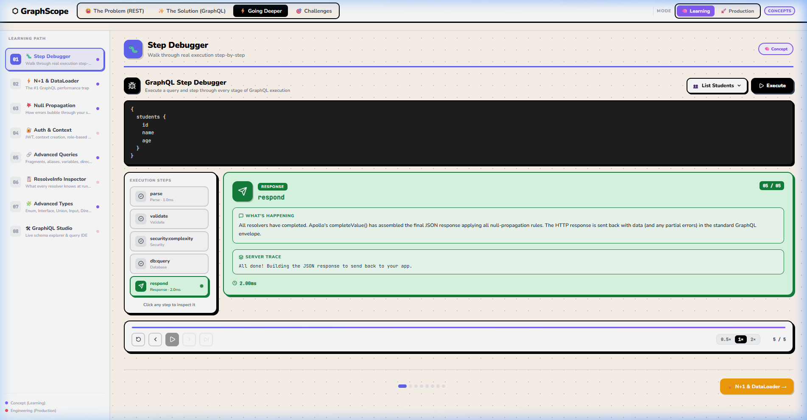

<p align="center">
  <h1 align="center">⬡ GraphScope</h1>
  <p align="center">
    <strong>An interactive, visual 3D GraphQL learning platform that streams real execution traces from Apollo Server + PostgreSQL/SQLite.</strong>
  </p>
  <p align="center">
    <a href="https://graph-ql-omega.vercel.app">
      
    </a>
    <a href="https://github.com/AyushPatil615/GraphQL/actions/workflows/ci.yml">
      
    </a>
  </p>
  <p align="center">
    <a href="https://graph-ql-omega.vercel.app">🌐 Try Live App</a> •
    <a href="#-what-is-graphscope">What is GraphScope</a> •
    <a href="#-the-learning-problem-it-solves">Problem It Solves</a> •
    <a href="#-the-4-act-learning-journey">4-Act Journey</a> •
    <a href="#-what-is-graphql-core-theory">GraphQL Theory</a> •
    <a href="#-interactive-ast-explorer">AST Explorer</a> •
    <a href="#-what-the-interactive-ui-shows">UI Breakdown</a> •
    <a href="#%EF%B8%8F-architecture--how-it-works">Architecture</a> •
    <a href="#-getting-started">Getting Started</a> •
    <a href="#-database--seed-data">Database & Seed Data</a> •
    <a href="#-distributed-cloud-deployment">Cloud Deployment</a> •
    <a href="#-design-system">Design System</a> •
    <a href="#-license">License</a>
  </p>
</p>

---

<p align="center">
  
  
  
  
  
  
  
  
</p>


---

<p align="center">
  
</p>

---

## 🌟 What is GraphScope?

**GraphScope** is an open-source interactive learning playground built for developers who learn best by watching real systems execute in front of them.

GraphScope runs a **real Apollo Server v4 backend** (connected to local SQLite or cloud Supabase PostgreSQL) and streams every execution step to the browser over Server-Sent Events (SSE) in real time. The UI animates each step as it happens, explains what the step does, and shows the exact JSON that came back. No mocking, no fake timers — the pipeline you see is the pipeline that ran.

---

## 🧠 The Learning Problem It Solves

Most GraphQL tutorials explain concepts with static diagrams or code blocks. A developer reads *"the resolver fetches data from the database"* but has no mental model of *when* that happens, *what triggered it*, or *what happens if they remove a field from the query*.

GraphScope makes the abstract concrete:

- **You see the pipeline light up step by step** as the server actually processes your query.
- **You toggle a field off** (e.g. `courses`) and watch the Courses Resolver go dark — because the server literally never called it.
- **You inspect the live Abstract Syntax Tree (AST)** and see how the parser breaks query text into Document, Operation, SelectionSet, and Field nodes.
- **You watch a 3D rocket travel planet-to-planet** through execution phases (*Client Planet -> Parser Gas Giant -> Validator Moon -> Resolver Lava World -> Database Cyber Core*).
- **You see the live N+1 problem** stream separate SQL queries in red, then toggle DataLoader ON to watch them condense into 1 batched query in green.
- **You test your understanding** with interactive challenges and quizzes that verify your knowledge of execution order, null bubbling, and DataLoader batching.
- **You read plain-English explanations** of each step, written for someone who has never heard the word "resolver" before.
- **You see the actual JSON response** returned from the server, shaped identically to the query you wrote.

---

## 🎬 The 4-Act Learning Journey

```text
 🍊 1. The Problem (REST)   ───► ✨ 2. The Solution (GraphQL)
 (Waterfall & Overfetching)      (3D Space + AST Explorer + Pipeline)
             │
             ▼
 ⚡ 3. Going Deeper        ───► 🎯 4. Interactive Challenges
 (N+1 Problem & DataLoader)      (Active Quizzes & Scenarios)
```

1. **😩 Act 1 — The Problem (REST)**: Interactive restaurant metaphor & real network waterfall demonstrating why REST APIs struggle with relational data, overfetching, and underfetching.
2. **✨ Act 2 — The Solution (GraphQL)**: Live Query Builder, Mutation Editor, and procedural **3D Solar System Traversal** paired with the **Interactive AST Explorer**.
3. **⚡ Act 3 — Going Deeper**: Eight advanced interactive modules in a **sidebar-navigated learning path** — **🐛 Step Debugger**, **N+1 Problem & DataLoader**, **Null Bubbling & `completeValue()`**, **Auth & Context Flow**, **Advanced Query Patterns (Variables, Fragments & Aliases)**, **`GraphQLResolveInfo` Inspector**, **Advanced Types**, and **Embedded GraphiQL Studio**. Each streams real server events.
4. **🎯 Act 4 — Interactive Challenges**: 6 scenario-based quizzes that test learners on query multipliers, execution lifecycle order, null bubbling, and field collection directives.

---

## 📖 What is GraphQL? (Core Theory)

**GraphQL** is an open-source query language for APIs and a server-side runtime for executing queries using a type system you define for your data. Created by Facebook (Meta) in 2012 and open-sourced in 2015, GraphQL was designed to solve the rigidity, over-fetching, and under-fetching issues inherent in traditional REST APIs.

### 1. Core Pillars of GraphQL

- 🎯 **Declarative Data Fetching**: The client specifies *precisely* what data it needs in a single query string, and the server returns a JSON response shaped identically to the request.
- 🔗 **Single HTTP Endpoint**: Instead of navigating dozens of REST endpoints (`GET /api/users`, `GET /api/users/1/posts`, `GET /api/comments`), GraphQL exposes a single endpoint (typically `POST /graphql`).
- 🛡️ **Strongly Typed Schema**: The API contract is explicitly written in GraphQL Schema Definition Language (SDL). Every field, object type, argument, and return type is strictly checked at validation time.
- ⚙️ **Resolver-Driven Architecture**: The server maps schema fields to individual JavaScript/TypeScript functions called **resolvers**. Resolvers fetch data from any data source (SQL databases, NoSQL, microservices, or REST endpoints).

### 2. Key Terminology

| Concept | Description | Example |
|---|---|---|
| **Schema Definition (SDL)** | The contract defining object types, fields, and queries available on the server. | `type Student { id: ID!, name: String!, age: Int }` |
| **Query** | A read-only operation requested by the client. | `query { student(id: "1") { name } }` |
| **Mutation** | A write operation used to insert, update, or delete data on the server. | `mutation { enrollStudent(studentId: "1", courseId: "c1") { success } }` |
| **Subscription** | A real-time WebSocket/Event connection for server-push updates. | `subscription { studentEnrolled { id } }` |
| **Resolver** | A server-side function that populates data for a specific schema field. | `Query: { student: (_, args) => db.find(args.id) }` |
| **DataLoader** | A batching & caching utility to solve N+1 database queries. | `new DataLoader(keys => db.getBatched(keys))` |
| **AST (Abstract Syntax Tree)** | The parsed tree representation of raw query string used during validation & execution. | Internal object generated by `graphql-js` parser |

### 3. GraphQL vs. REST Comparison

| Dimension | REST API | GraphQL API |
|---|---|---|
| **Endpoint Structure** | Multiple URLs (`/students`, `/courses`) | Single URL (`/graphql`) |
| **Data Fetching Control** | Server decides returned fields | Client decides returned fields |
| **Network Requests** | Often requires multiple waterfall round trips | Single request for deeply nested graph data |
| **Over-Fetching** | High (returns unneeded object properties) | Zero (only returns requested fields) |
| **Under-Fetching** | High (requires follow-up requests for relational data) | Zero (relationships resolved in one tree execution) |
| **Type Safety** | Optional (requires OpenAPI/Swagger schemas) | Built-in (strict schema validation before execution) |

---

## 🌲 Interactive AST Explorer

When you write a GraphQL query, the server cannot execute raw text directly. The **Parser** first converts the text into an **Abstract Syntax Tree (AST)**:

```text
📁 Document (Root)
 └── 🟣 OperationDefinition (QUERY)
      └── 🟠 SelectionSet { … }
           └── 🟢 Field: student
                ├── 🔴 Argument: id = "1"
                └── 🟠 SelectionSet { … }
                     ├── 🟢 Field: name
                     └── 🟢 Field: courses
                          └── 🟠 SelectionSet { … }
                               └── 🟢 Field: title
```

GraphScope's **AST Explorer** renders this parsed hierarchy in real time:
- **Color-Coded Badges**: Identifies Document, Operation, SelectionSet, Field, and Argument nodes.
- **Interactive Collapsible Branches**: Expand (`▼`) or collapse (`▶`) individual subtrees.
- **Live Sync**: Updates automatically as you toggle fields or edit queries.

---

## 🖥️ What the Interactive UI Shows

### Tab 1 — 😩 The Problem (REST)

An animated waterfall showing what fetching the same data looks like over REST:

```text
GET /api/students/1      → 45ms  → { id, name, age }
GET /api/courses/c1      → 38ms  → { id, title }
GET /api/courses/c3      → 35ms  → { id, title }
                                   ─────────────
                                   118ms  ·  3 requests
```

Each request animates sequentially — the next one can't start until the previous one returns. After all three complete, the GraphQL equivalent plays:

```text
POST /graphql { student(id:"1") { name age courses { title } } }
                                   ─────────────
                                   21ms  ·  1 request
```

The comparison cards then show the concrete numbers: **5.6× faster, 3× fewer requests, 0 over-fetching**.

#### 💡 Beginner's Primer Side Drawer (`💡 New to APIs?`)
Located at the top-left of Tab 1, a collapsible floating drawer designed for beginners who are completely new to APIs and backend architecture:
- **What is an API?**: Restaurant waiter analogy explaining client, API, and database roles.
- **HTTP Methods Breakdown**: Color-coded badges and descriptions for `GET`, `POST`, `PUT`, and `DELETE`.
- **The REST Overfetching Problem**: Visual breakdown of 3 cascading HTTP network round-trips for profile data.
- **What is GraphQL?**: Single-request querying with exact field selection.
- **Side-by-Side Comparison Matrix**: 8-point architectural comparison table (Endpoints, Typing, Over/Under-fetching, Real-time, Introspection).
- **Core Vocabulary Glossary**: Quick definitions for *Client*, *Server*, *Endpoint*, *Schema*, *Query*, *Mutation*, *Resolver*, and *Subscription*.

---

### Tab 2 — ✨ The Solution (GraphQL Demo)

#### Column 1 — Query Builder & Mutation Editor
A live code editor showing the current GraphQL query. Below it, three field toggles:

| Field | Toggle | Effect |
|---|---|---|
| `name` | 🔒 locked | Always required — anchors the query |
| `age` | ✅ on/off | Toggles the `age` field in the query string |
| `courses` | ✅ on/off | Toggles the `courses { title }` nested selection set |

- Dual Domain Switcher: **Education** (`students`, `courses`) & **Healthcare** (`patients`, `doctors`).
- Side-by-side SQL Data Diffing showing `Before` vs `After` snapshots on mutations.

#### Column 2 — 3D Solar System & Execution Pipeline

Six nodes that light up as the server processes the query:

```text
◈ Parser           ← reads raw query text → AST
✦ Validator        ← checks fields exist in schema
⬡ Student Resolver ← calls your resolver function
◉ Database         ← runs SELECT against PostgreSQL/SQLite
⬡ Courses Resolver ← only runs if courses was requested
✓ JSON Response    ← assembles and returns JSON
```

- **View Toggle**: Switch between `🪐 3D Solar System Traversal` (procedural Three.js flight) and `🌲 Interactive AST Explorer` (live syntax tree).

#### Column 3 — Step Dialogue Panel & Debugger
- Real-time explanations (*How it works*, *What it takes*, *In context*, *Code example*).
- Displays the **actual JSON response** returned from the server.
- Step Debugger toolbar with `Step Over`, `Step Back`, `Play / Pause`, and speed multipliers (`0.5×`, `1×`, `2×`).

---

### Tab 3 — ⚡ Going Deeper

#### 📌 Guided Learning Path (Sidebar Navigation)

The **Going Deeper** tab features a sticky left-sidebar navigation so users always know where they are and what comes next — no endless scrolling:

- **8 numbered modules** listed with a sublabel describing what each one teaches.
- **Single content panel**: only the selected module is displayed — click to switch instantly.
- **Active state highlights** the selected module with its unique accent color.
- **Bottom Prev ← → Next navigation** with progress dots for linear walkthrough.
- **Mode indicator dots** — purple for 🧠 Learning concepts, red for 🚀 Production engineering topics.

---

#### 0. 🐛 Step Debugger (Walk Through Real Execution)

The **killer differentiator feature** — an interactive replay debugger that lets learners execute a real GraphQL query and step through every server-side execution stage one event at a time, exactly like a code debugger:

```text
Execute → [ parse ] → [ validate ] → [ auth:context ] → [ db:query ] → [ respond ]
              ▲             ▲                ▲                ▲             ▲
         Detailed       Detailed         Detailed          Detailed     Detailed
       explanation    explanation      explanation       explanation  explanation
```

**5 Preset Queries to step through:**

| Preset | Query | Steps it reveals |
|---|---|---|
| `List Students` | `{ students { id name age } }` | parse, validate, auth context, db:query, respond |
| `Nested Query` | `{ student(id: "1") { name courses { title } } }` | resolver:info + multiple db queries |
| `Auth Check` | `{ me { id name role } }` | auth:context:read + rejection on missing token |
| `Login Mutation` | `mutation { login(...) { token user { role } } }` | auth:login + auth:token:issued |
| `N+1 Problem` | `{ studentsN1 { courses { title } } }` | Individual db:query:n1:1…N firing per student |

**Debugger Controls:**
- `⏮ Restart` / `◀ Prev` / `▶ Play` / `⏸ Pause` / `Next ▶` / `⏭ End`
- Speed selector: `0.5×` `1×` `2×` (auto-play between steps)
- Animated progress bar and step counter (`03 / 05`)

**Step Detail Panel (per step):**
- Color-coded phase badge (Parse / Validate / Security / Auth / Resolver / Database / Response)
- Lucide icon per step type (`ScanText` for parse, `Database` for db:query, `KeyRound` for auth, etc.)
- 3-sentence plain-English explanation of exactly what GraphQL is doing at this stage
- Server-emitted caption and timing from the real Apollo trace event
- Click any completed step in the list to jump back and inspect it

---

#### 1. N+1 Problem & DataLoader Visualizer
- Demonstrates how nested queries trigger $1 + N$ database queries when unbatched.
- Live database query streamer showing separate queries in red vs 1 batched `WHERE IN (...)` query in green when DataLoader is toggled ON.

#### 2. 🕳️ Null Bubbling & Partial Failure (`completeValue()`)
One of the hardest concepts in GraphQL — what happens when a resolver fails:

```text
Nullable field (Int)  → age resolver throws → age: null ← null STAYS HERE
                                               name, courses still resolve ✅

Non-Null field (Int!) → age resolver throws → age CANNOT be null
                                               null BUBBLES UP to student
                                               student: null (siblings discarded) ❌
```

- **Schema Toggle**: Switch between `age: Int` (nullable) and `age: Int!` (non-null) to see the difference.
- **💥 Trigger Failure Button**: Makes the `age` resolver throw a real error on the server.
- **Propagation Tree**: Animates which nodes turn red (bubbled) or grey (discarded).
- **Side-by-side JSON Diff**: Shows live `data` + `errors[]` response from the actual server.
- **Explanation Panel**: Plain-English breakdown of what `completeValue()` did and why.

#### 3. 🔐 Auth & Context Flow
Teaches how `Authorization: Bearer <token>` headers flow through GraphQL's context system:

```text
HTTP Request                     context() fn                    Resolver
────────────────────────────► ──────────────────────────────► ─────────────────
Authorization: Bearer eyJ... → verifyToken(token) → ctx.user  resolver(_, _, ctx)
                                                              if (!ctx.user) throw
```

- **Login Simulation**: Pick from 3 demo users (`alice/ADMIN`, `bob/VIEWER`, `charlie/VIEWER`).
- **JWT Token Issuance**: Server issues a realistic `header.payload.signature` JWT using Node's built-in `crypto`.
- **Animated Flow Diagram**: Watch HTTP Request → context() fn → ctx.user → Response light up step by step.
- **Code Snippet Panel**: See the actual server code at each stage (`index.ts`, `resolvers/index.ts`).
- **Live `me` Query**: Test the protected query with and without a token and see the real GraphQL response.
- **Resolver Signature Reference**: Shows all 4 resolver args (`parent`, `args`, `context`, `info`) explained.

#### 4. 📦 Advanced Query Patterns (Variables, Fragments & Aliases)
Interactive exploration of core query mechanics used in production GraphQL clients:

- **📦 Variables (`$id: ID!`)**: 
  - Dynamic ID selector (`Alex Rivera`, `Priya Sharma`, `Jordan Lee`).
  - Animated 4-step execution flow: `Variables Object` ➔ `Schema Validation` (type-checked before execution) ➔ `Resolver args` ➔ `Database Query`.
  - Live query runner returning typed JSON responses from Apollo Server.
- **🏷️ Aliases (`studentA: student(id: "1")`)**:
  - Resolves key collisions when querying the same field multiple times in a single round-trip.
  - Interactive diagram illustrating how AST parsing maps aliased fields to custom JSON response keys.
- **📎 Fragments (`...StudentCard`)**:
  - Demonstrates the DRY (Don't Repeat Yourself) principle and Relay fragment colocation pattern.
  - Shows how fragment definitions are merged into parent selection sets during AST execution without duplicate database queries.

#### 5. 🔍 `GraphQLResolveInfo` Inspector (The 4th Resolver Argument)
Deep dive into `resolver(parent, args, context, info)` — demystifying the least understood argument in GraphQL:

```text
resolver(parent, args, context, info)
                                 └── GraphQLResolveInfo (Field metadata & AST node)
```

- **Interactive Signature Explorer**: Visual breakdown of all 4 resolver parameters with interactive tooltips.
- **Live Query Options**: Test single-resolver (`student`) vs nested-resolver (`student + courses`) executions.
- **Live `info` Event Streaming**: Server emits real `resolver:info` events over SSE capturing live snapshots:
  - `fieldName`: Exact schema field currently executing.
  - `returnType`: Runtime GraphQL type representation (e.g. `Student`, `[Course!]!`).
  - `parentType`: Owning schema type (e.g. `Query` shifting to `Student` for nested relations).
  - `path`: Full hierarchical execution path trace (`student` ➔ `courses`).
  - `fieldNodes (selections)`: Sub-fields requested by the client (enabling SQL SELECT column optimizations).
  - `variableValues (argKeys)`: Active request variables passed into execution.
- **Interactive Hover Legend**: Hover any field property to view its architectural role in production resolvers (tracing, field-level auth, database query projection).

#### 6. 🔣 Advanced Schema Types (`Enum`, `Interface`, `Union`, `Input`, `Directive`)
Comprehensive interactive visualizer demonstrating GraphQL's advanced type system:
- **🔢 Enum (`Role`, `Permission`)**: Strict type restrictions, client-side role picker, and schema-level validation rejection explanations.
- **📐 Interface (`Node`)**: Abstract contract defining common fields (`id`, `name`) across distinct concrete types (`StudentNode`, `CourseNode`).
- **🔀 Union (`SearchResult`)**: Polymorphic search returning heterogeneous types with `__resolveType` discrimination and inline fragments (`... on StudentNode`).
- **📥 Input Object Type (`SearchInput`)**: Complex structured inputs with validation rules and output-vs-input comparison matrix.
- **✨ Directives (`@skip`, `@include`)**: Live interactive query demonstration with `@skip(if: $hideAge)` dynamically omitting response fields.

#### 7. 🎮 Embedded GraphiQL Studio (Live Schema Explorer)
Full in-browser GraphQL IDE directly embedded into the application, connected live to the backend server:
- **Full IDE Capabilities**: Monaco editor with syntax highlighting, schema validation, autocomplete (`Ctrl+Space`), and query execution (`Ctrl+Enter`).
- **8 Live Presets Across Domains**: One-click quick starts for *All Students*, *Student by ID (Variables)*, *Advanced Types (Enum + Union)*, *Me (Auth)*, *Login (Mutation)*, *Patients (Healthcare)*, *Null Bubbling Demo*, and *N+1 vs DataLoader*.
- **Integrated Documentation & Variable Panel**: Built-in interactive schema docs explorer and JSON variables editor.

---

### 🧠 Learning Mode vs. 🚀 Production Mode Toggle
A global sticky header toggle allowing users to switch the educational perspective across the entire app:
- **🧠 Learning Mode**: Emphasizes conceptual foundations — AST parsing, resolver execution lifecycle, null bubbling, and DataLoader batching.
- **🚀 Production Mode**: Emphasizes enterprise engineering — JWT authentication, GraphQL security controls (depth/complexity limits), rate limiting, and resolver telemetry.
- **Adaptive Visual Accents**: Dynamic badges and color-coded section headers that highlight topics based on the active mode.

---

### 🛡️ Production Security & Quality Controls

GraphScope is built with production-grade GraphQL security controls to protect the public API from abuse:

1. **🛡️ Query Depth Limiting (`graphql-depth-limit`)**:
   - Enforces a maximum execution depth of 8 levels.
   - Prevents recursive query DOS attacks (`student -> courses -> students -> courses -> ...`).
   - Automatically returns standardized `QUERY_TOO_DEEP` error extensions before resolving database queries.
2. **🔢 Query Complexity Analysis (`graphql-query-complexity`)**:
   - Analyzes AST field weights and array multipliers before execution with a strict threshold (100 complexity points).
   - Emits real-time SSE trace events showing calculated query complexity.
   - Rejects expensive queries with `QUERY_TOO_COMPLEX` error extensions.
3. **⏱️ API Rate Limiting (`express-rate-limit`)**:
   - Limits IP requests on `/graphql` to 100 requests/minute while keeping `/events` SSE channels open.
   - Returns standard `RATE_LIMITED` payload with retry headers.
4. **🏷️ Standardized Error Responses (`Errors.*`)**:
   - Uniform error formatting across all queries, mutations, and security middleware: `UNAUTHENTICATED`, `FORBIDDEN`, `NOT_FOUND`, `BAD_USER_INPUT`, `QUERY_TOO_DEEP`, `QUERY_TOO_COMPLEX`, and `RATE_LIMITED`.

---

### Tab 4 — 🎯 Interactive Challenges
- 6 interactive quizzes with difficulty tiers (*Beginner*, *Intermediate*, *Advanced*).
- Instant answer feedback with explanations of underlying GraphQL mechanics.

---

## 🏗️ Architecture & How It Works

The key insight is that the pipeline animation is driven by **real server events**, not pre-scripted timers.

```
Browser (Vite Client :5173)                 Server (Apollo + Express :4000)
  │                                                      │
  ├─ 1. EventSource /events?requestId=UUID ────────────► │ SSE Client Register (Keep-Alive)
  │                                                      │
  ├─ 2. Wait 80ms (ensures SSE ready)                    │
  │                                                      │
  ├─ 3. POST /graphql (Header: x-request-id) ──────────► │ Apollo Execution Engine
  │                                                      │  ├─ ◈ Parser Hook
  │ ◄── SSE event: { step: "parse", ms: 1 } ─────────────┤  ├─ ✦ Validator Hook
  │ ◄── SSE event: { step: "validate", ms: 6 } ──────────┤  ├─ ⬡ Query.student Resolver
  │ ◄── SSE event: { step: "db:query", ms: 8 } ──────────┤  ├─ ◉ Database Query (Postgres/SQLite)
  │ ◄── SSE event: { step: "resolve:courses" } ──────────┤  ├─ ⬡ Student.courses Resolver
  │ ◄── SSE event: { step: "__done__" } ─────────────────┘  └─ ✓ Response Assembly
  │                                                      │
  └◄── HTTP 200 JSON Response ───────────────────────────┘
```

### The Apollo Plugin (`tracingPlugin.ts`)

`server/src/plugins/tracingPlugin.ts` implements `ApolloServerPlugin`. Apollo calls lifecycle hooks at each execution stage — the plugin measures elapsed time and emits an SSE event per step:

```ts
async parsingDidStart() {
  const t = Date.now();
  return async () => {            // fired when parsing ENDS
    emitTrace(requestId, {
      step: 'parse',
      ms: Date.now() - t,
      caption: 'GraphQL read your query text and converted it into a structured tree (AST).',
    });
  };
},
```

The `requestId` ties each SSE event to the correct browser tab. Multiple tabs can run queries simultaneously without cross-contamination.

### Why `documentStore: null`?

Apollo Server v4 caches parsed and validated query documents in memory by default (its `documentStore`). On repeated runs of the same query string, it reuses the cached AST and skips `parsingDidStart` and `validationDidStart` entirely.

For a production API this is a sensible optimization. For a learning tool it's fatal — Parser and Validator appear permanently grayed out after the first run.

Setting `documentStore: null` disables the cache, forcing Apollo to re-parse and re-validate every request, so the full pipeline is always visible.

### The SSE Hook (`useGraphQLTrace`)

```ts
export function useGraphQLTrace(query: string, domainId = 'education') {
  // 1. Open EventSource before sending the query
  const es = new EventSource(`${baseUrl}/events?requestId=${requestId}`);

  // 2. Collect steps as they arrive
  es.onmessage = (e) => {
    const event = JSON.parse(e.data);
    if (event.step === '__done__') { setPhase('complete'); es.close(); return; }
    setSteps(prev => [...prev, event]);
  };

  // 3. Fire query to Apollo backend
  await fetch(`${baseUrl}/graphql`, {
    method: 'POST',
    headers: { 'Content-Type': 'application/json', 'x-request-id': requestId },
    body: JSON.stringify({ query }),
  });
}
```

---

## 📁 Repository Structure

```text
graphql_learner/
├── client/                        # Vite + React 18 Frontend
│   └── src/
│       ├── App.tsx                # 4-Tab Navigation (REST | Solution | Deeper | Challenges)
│       ├── index.css              # Cream Neobrutalism tokens & responsive styles
│       ├── config/api.ts          # Centralized API base URL reader
│       ├── context/
│       │   └── ModeContext.tsx    # Learning / Production mode global context & hook
│       ├── components/
│       │   ├── FakeDemo/          # Query builder, field toggles & visualizer layout
│       │   ├── ASTExplorer/       # Interactive Abstract Syntax Tree breakdown
│       │   ├── Challenges/        # Interactive scenario-based quizzes
│       │   ├── Theory3D/          # Three.js 3D Solar System traversal
│       │   ├── N1Visualizer/      # N+1 & DataLoader query streamer
│       │   ├── NullBubble/        # Null Bubbling & completeValue() visualizer
│       │   ├── AuthFlow/          # Auth & Context Flow interactive demo
│       │   ├── AdvancedQueries/   # Variables, Fragments & Aliases visualizer
│       │   ├── ResolveInfo/       # GraphQLResolveInfo 4th arg inspector
│       │   ├── AdvancedTypes/     # Enums, Interfaces, Unions, Input Types & Directives
│       │   ├── GraphiQL/          # Embedded GraphiQL Studio with 8 live presets
│       │   ├── StepDebugger/      # Step-by-step execution replay debugger
│       │   │   ├── StepDebugger.tsx   # Main component (preset selector, split layout)
│       │   │   ├── StepList.tsx       # Left panel — numbered step pills with Lucide icons
│       │   │   ├── StepDetail.tsx     # Right panel — phase badge, explanation, timing
│       │   │   ├── DebuggerControls.tsx # Play/Pause/Prev/Next + speed + progress bar
│       │   │   └── stepMeta.ts        # Step ID → icon, color, explanation map
│       │   ├── MutationDemo/      # Mutation editor & SQL diff panel
│       │   ├── PipelineVisualizer/# Animated 6-step node visualizer
│       │   └── ExecutionTimeline/ # Horizontal timeline & Step Debugger toolbar
│       ├── data/                  # Schema presets, domain definitions & dialogues
│       └── hooks/                 # Custom SSE trace listeners
│
└── server/                        # Node.js + Apollo Server v4 Backend
    └── src/
        ├── index.ts               # Express app, SSE route, IPv4 DNS, Auth context & Apollo middleware
        ├── schema/typeDefs.ts     # GraphQL SDL schema (Education, Healthcare, Auth, Null Demo)
        ├── resolvers/index.ts     # Async query, mutation, auth, relational resolvers & info telemetry
        ├── auth/jwt.ts            # Zero-dependency fake JWT for the auth learning demo
        ├── security/
        │   └── controls.ts        # Query depth limit, query complexity, rate limiter & standardized errors
        ├── db/
        │   ├── database.ts        # Hybrid SQLite / Supabase PostgreSQL adapter
        │   └── seed_postgres.ts   # Cloud database schema migration & seed script
        ├── plugins/tracingPlugin.ts # Apollo plugin emitting SSE execution events
        └── tracer.ts              # SSE client registry & event emitter helper
```

---

## 🛠️ Tech Stack

| Layer | Technology | Purpose |
|---|---|---|
| **Frontend** | React 18 + TypeScript + Vite | Interactive UI & state management |
| **Icons** | Lucide React | Step Debugger phase icons (Database, KeyRound, ScanText, Zap, etc.) |
| **3D Graphics** | Three.js | Procedural planets & Catmull-Rom rocket flight curve |
| **Animations** | Framer Motion | Fluid card transitions, toggle animations, timeline bars |
| **Styling** | Vanilla CSS | Cream Neobrutalism design system — bold 3px borders, offset shadows |
| **Backend API** | Apollo Server v4 + Express | Real GraphQL execution server & SSE streaming |
| **Database** | Supabase (PostgreSQL) / SQLite | Hybrid cloud/local relational database |
| **Live Tracing** | Server-Sent Events (SSE) | Real-time execution event streaming per pipeline step |

---

## 🗄️ Database & Seed Data

GraphScope includes support for both local embedded SQLite and cloud Supabase PostgreSQL:

### Seed Datasets:
- **Education Domain**:
  - `Alex Rivera` (Age 21) → Enrolled in *Intro to Computer Science* & *Web Development*
  - `Priya Sharma` (Age 23) → Enrolled in *Intro to Computer Science*, *Data Structures*, *Databases & SQL*
  - `Jordan Lee` (Age 20) → Enrolled in *Web Development* & *Algorithms*
- **Healthcare Domain**:
  - `Sarah Connor` (Age 29) → Appointments with *Dr. Gregory House* & *Dr. Beverly Crusher*
  - `John Watson` (Age 38) → Appointments with *Dr. Miranda Bailey* & *Dr. Gregory House*
  - `Elena Gilbert` (Age 24) → Appointment with *Dr. Meredith Grey*

---

## ☁️ Distributed Cloud Deployment

GraphScope supports a cloud architecture:

```text
 ┌─────────────────┐       GraphQL / SSE       ┌─────────────────┐
 │   Vercel (UI)   │ ────────────────────────> │ Render / Railway│
 │ React / Vite    │                           │ (Node + Apollo) │
 └─────────────────┘                           └────────┬────────┘
                                                        │ SQL Queries (IPv4 Pooler:6543)
                                                        ▼
                                               ┌─────────────────┐
                                               │    Supabase     │
                                               │   (Postgres)    │
                                               └─────────────────┘
```

1. **Supabase**: Cloud PostgreSQL Database (Seed with `DATABASE_URL="..." npm run seed:postgres`).
2. **Render / Railway**: Node.js Apollo Server + SSE endpoint with IPv4 Connection Pooler.
3. **Vercel**: Static React frontend deployment.

---

## 🚀 Getting Started (Local Development)

### Prerequisites
- **Node.js**: v18.0.0 or higher
- **npm**: v9.0.0 or higher

### 1. Clone & Install
```bash
git clone https://github.com/AyushPatil615/GraphQL.git
cd GraphQL

# Install server dependencies
cd server && npm install

# Install client dependencies
cd ../client && npm install
```

### 2. Run Local Development
Open **two terminal windows**:

**Terminal 1 (Server):**
```bash
cd server
npm run dev
```

**Terminal 2 (Client):**
```bash
cd client
npm run dev
```

Open your browser at **`http://localhost:5173`**.

---

## 🎨 Design System

The UI uses **Cream Neobrutalism**:
- Warm cream background (`#FFF8F0`) with a subtle dot grid.
- Bold 3px black borders with offset box shadows (`5px 5px 0 #000`).
- Saturated, warm accent colors (sky blue, lavender, coral, mint).
- Typography: `Nunito` (sans-serif UI) + `JetBrains Mono` (code & stats).

---

## 📄 License

This project is open-source and available under the [MIT License](LICENSE).
